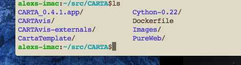
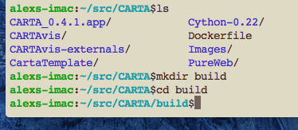
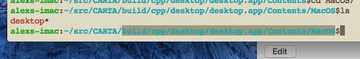

How to compiler CARTA
=====================

Introduciton
------------
At the present time we have successfully compiled CARTA viewer on the following
platforms - **Ubuntu 14.04**, **Cent OS 6.7** and **Mac OS X 10.10**.
It is possible to compile and build CARTA viewer on other UNUIX like OSes,
however these are the officially supported operating systems for CARTA deployment.
This guide will provide detail instructions on how to build CARTA viewer for the above platforms.

Downloading CARTA source code
-----------------------------
CARTA source code is publicly available on the git hub via following CARTA_ github link.
It can be cloned using::

    $git clone https://github.com/Astroua/CARTAvis

You have to make sure that you have version git client higher than 1.7 (this can be an issue with **CentOS 6.7**).
It should be cloned into some directory on your build machine, which will be referred further in this document as
:file:`$CARTAROOT`.
In the example below :file:`$CARTAROOT` is set to :file:`$HOME/src/CARTA`.

.. _CARTA: https://github.com/Astroua/CARTAvis

Software required to build on Ubuntu 14.04
------------------------------------------

Installing development tools and required libraries
~~~~~~~~~~~~~~~~~~~~~~~~~~~~~~~~~~~~~~~~~~~~~~~~~~~

To compile CARTA C++ compiler that supports *C++ 11* standards is required.
On Ubuntu 14.04 we are using *g++ 4.8.2*.
It can be installed using following command::

    $sudo apt-get install -y build-essential

Other development tools such as *git*, *autoconf*, *automaker*, *cmake* need to be installed as well via *apt-get*.
Ubuntu 14.04 comes with *Python 2.7* installed, if it is not on the system it has to be installed as well along with
*NumPy*, *Astropy* and *Cython* python modules.
Following development libraries are required to be present *mesa-common-dev* and *libglul-mesa-dev*.

Installing QT library
~~~~~~~~~~~~~~~~~~~~~

Open source Qt Framework & Qt Development Tools can be downloaded from http://www.io.qt web site.
At the present time we are using qt version 5.3 for CARTA development. Version 5.3 is not the
latest one but it is available for download form qt web site and should be used.
There is QT graphical installer for linux/Mac OSX  platforms.

Installing CASACORE library
~~~~~~~~~~~~~~~~~~~~~~~~~~~
*CASACORE* library is available on CASACORE_ github  and can be cloned using following command::

    $git clone https://github.com/casacore/casacore

There are number of required packages that are needed to be installed before CASACORE library it can be compiled.
To be able to use *CASACORE* library *CASACORE data* package needs to be available on the system
(also knows as casacore measures data).
It is usually installed in :file:`@HOME/data` directory or in :file:`/usr/local/geodetic` and :file:`/usr/local/ephemerides` directories.

.. _CASACORE: https://github.com/casacore/casacore

Installing third party libraries
~~~~~~~~~~~~~~~~~~~~~~~~~~~~~~~~

We need to create directory with soft links to all third party libraries in order to successfully build CARTA.
Here is instructions on how to do that::

    $cd $CARTAROOT
    $mkdir -d CARTAvis-externals/ThirdParty
    $cd CARTAvis
    $ln -s ../CARTAvis-externals Externals
    $ln -s ./Externals/ThirdParty ThirdParty

Inside :file:`ThirdPary` directory there will be links to locations where all third party libraries are located.
Following libraries/packages are required to be installed and soft links to their locations creatred:

    *qwt-6.1.3* - graphics extension to the Qt GUI application framework

    *qooxdoo-3.5* - this is not the latest version but CARTA will not work with latest version, it is very important to install 5.3 version.

    *cfitsio-3360*

    *wcslib-4.23*

    *pureweb-4.1.1*

    *ast-8.0.2*

    *casacore* - link to casacore library that has been compiled

In the directory :file:`$CARTAROOT/CARTAvis/carta/scripts` there is script :file:`createlinks.sh` that will create soft
links inside :file:`ThirdParty` directory.
It needs to be edited and adjusted to reflect locations of installed packages on the target system.

Software required to build on Cent OS 6.7
-----------------------------------------

Installing development tools and required libraries
~~~~~~~~~~~~~~~~~~~~~~~~~~~~~~~~~~~~~~~~~~~~~~~~~~~

Installing QT library
~~~~~~~~~~~~~~~~~~~~~

Open source Qt Framework & Qt Development Tools can be downloaded from http://www.io.qt web site.
At the present time we are using qt version 5.3 for CARTA development. Version 5.3 is not the
latest one but it is available for download form qt web site and should be used.
There is QT graphical installer for linux/Mac OSX  platforms.

Installing CASACORE library
~~~~~~~~~~~~~~~~~~~~~~~~~~~
*CASACORE* library is available on CASACORE_ github  and can be cloned using following command::

    $git clone https://github.com/casacore/casacore

There are number of required packages that are needed to be installed before CASACORE library it can be compiled.
To be able to use *CASACORE* library *CASACORE data* package needs to be available on the system
(also knows as casacore measures data).
It is usually installed in :file:`@HOME/data` directory or in :file:`/usr/local/geodetic` and :file:`/usr/local/ephemerides` directories.

Installing third party libraries
~~~~~~~~~~~~~~~~~~~~~~~~~~~~~~~~

We need to create directory with soft links to all third party libraries in order to successfully build CARTA.
Here is instructions on how to do that::

    $cd $CARTAROOT
    $mkdir -d CARTAvis-externals/ThirdParty
    $cd CARTAvis
    $ln -s ../CARTAvis-externals Externals
    $ln -s ./Externals/ThirdParty ThirdParty

Inside :file:`ThirdPary` directory there will be links to locations where all third party libraries are located.
Following libraries/packages are required to be installed and soft links to their locations creatred:

    *qwt-6.1.3* - graphics extension to the Qt GUI application framework

    *qooxdoo-3.5* - this is not the latest version but CARTA will not work with latest version, it is very important to install 5.3 version.

    *cfitsio-3360*

    *wcslib-4.23*

    *pureweb-4.1.1*

    *ast-8.0.2*

    *casacore* - link to casacore library that has been compiled

In the directory :file:`$CARTAROOT/CARTAvis/carta/scripts` there is script :file:`createlinks.sh` that will create soft
links inside :file:`ThirdParty` directory.
It needs to be edited and adjusted to reflect locations of installed packages on the target system.

Software required to build on Mac OSX 10.10
-------------------------------------------

Installing development tools and required libraries
~~~~~~~~~~~~~~~~~~~~~~~~~~~~~~~~~~~~~~~~~~~~~~~~~~~

Installing QT library
~~~~~~~~~~~~~~~~~~~~~

Open source Qt Framework & Qt Development Tools can be downloaded from http://www.io.qt web site.
At the present time we are using qt version 5.3 for CARTA development. Version 5.3 is not the
latest one but it is available for download form qt web site and should be used.
There is QT graphical installer for linux Ubuntu platform.

Installing CASACORE library
~~~~~~~~~~~~~~~~~~~~~~~~~~~
*CASACORE* library is available on CASACORE_ github  and can be cloned using following command::

    $git clone https://github.com/casacore/casacore

There are number of required packages that are needed to be installed before CASACORE library it can be compiled.
To be able to use *CASACORE* library *CASACORE data* package needs to be available on the system
(also knows as casacore measures data).
It is usually installed in :file:`@HOME/data` directory or in :file:`/usr/local/geodetic` and :file:`/usr/local/ephemerides` directories.

Installing third party libraries
~~~~~~~~~~~~~~~~~~~~~~~~~~~~~~~~

We need to create directory with soft links to all third party libraries in order to successfully build CARTA.
Here is instructions on how to do that::

    $cd $CARTAROOT
    $mkdir -d CARTAvis-externals/ThirdParty
    $cd CARTAvis
    $ln -s ../CARTAvis-externals Externals
    $ln -s ./Externals/ThirdParty ThirdParty

Inside :file:`ThirdPary` directory there will be links to locations where all third party libraries are located.
Following libraries/packages are required to be installed and soft links to their locations creatred:

    *qwt-6.1.3* - graphics extension to the Qt GUI application framework

    *qooxdoo-3.5* - this is not the latest version but CARTA will not work with latest version, it is very important to install 5.3 version.

    *cfitsio-3360*

    *wcslib-4.23*

    *pureweb-4.1.1*

    *ast-8.0.2*

    *casacore* - link to casacore library that has been compiled

In the directory :file:`$CARTAROOT/CARTAvis/carta/scripts` there is script :file:`createlinks.sh` that will create soft
links inside :file:`ThirdParty` directory.
It needs to be edited and adjusted to reflect locations of installed packages on the target system.

Generating CARTAvis html files
------------------------------
Before each compile javascript files need to be re-generated. Follow example below to re-generate javascript files::

    $cd $CARTAROOT/CARTAvis/carta/html5/common/skel
    $./generate.py source
    $./generate.py

This is very important step, skipping it might not break
compile process but will results in very unusual run time behaviour of CARTAvis.

Compiling CARTAvis desktop binaries
-----------------------------------

Instead of compiling executable in the same directory where source code is, we use separate build directory.
Change your working directory to the location where you want to create build directory and create build directory
as in the example below

Now issue *qmake* command to create all make files::

    $ qmake NOSERVER=1 CARTA_BUILD_TYPE=dev ~/src/CARTA/CARTAvis/carta -r

In this example :file:`~/src/CARTA/CARTAvis/carta` is the location where *CARTA* source code is located,
it has to be adjusted accordingly if it is different from the example above.
After all make files are generated source code can be compiled with make command as in the following example::

    $make -j4

Optionally *-jN* parameter can be used to speed up compile process with N simultaneous compiles.
*N* parameter should not exceed number of processors available on the build machine as this will not have any effect.

Compiling CARTAvis server binaries
----------------------------------

Compiling server binaries is the same as desktop one except when issuing make
command NOSERVER option should be set to 0 or omitted:
$ qmake NOSERVER=1 CARTA_BUILD_TYPE=dev ~/src/CARTA/CARTAvis/carta -r
Server executable will be compiled in cpp/server directory, relative to the build directory.

Running CARTAvis viewer after successful build
----------------------------------------------

After *CARTA* viewer has been successfully compiled its binary can be found in
:file:`build/cpp/desktop` directory on CentOS and Ubuntu platforms and in
:file:`build/cpp/desktop/CARTA.app/Contents/MacOS` on Mac OSX, screenshot below shows
location of CARTAvis binary on Mac OS X.

Name of the executable is “desktop”, it can executed using following command::

    ./desktop --html ~/src/CARTA/CARTAvis/carta/VFS/DesktopDevel/desktop/desktopIndex.html --scriptPort 9999

Third parameter is the location of :file:`desktopIndes.html` file, usually points to the place where source
code has been downloaded from git repository. In the example above *CARTA* source code has been placed in
:file:`~/src/CARTA` (pointing to by variable *$CARTAROOT*) directory. Optionally additional parameter
can be passed on the command line to specify image file to be open by the viewer on a startup,
as in the example below::

    ./desktop --html ~/src/CARTA//CARTAvis/carta/VFS/DesktopDevel/desktop/desktopIndex.html --scriptPort 9999 ~/CARTA/Images/555wmos.fits

